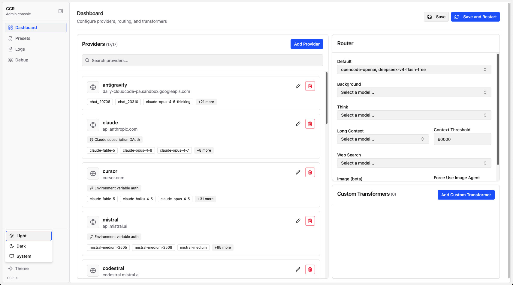

[](https://github.com/musistudio/claude-code-router/blob/main/LICENSE)

Claude Code Router is an adaptive LLM gateway for Claude Code. It routes each request to the most suitable model and provider while preserving tool calls, streaming, extended thinking, and multi-turn context across different APIs.

## ✨ Features

- **Adaptive Model Routing**: Route requests by scenario, including background tasks, thinking, long context, web search, and image workflows.
- **Tool Use & Thinking**: Preserve tool calls, tool results, and reasoning content across providers with different API formats.
- **Multi-Provider Support**: Supports various model providers like OpenRouter, DeepSeek, Ollama, Gemini, Antigravity, Volcengine, SiliconFlow, Codex, Claude subscription, Qwen, Chrome On-Device, and Cursor (SDK).
- **Request/Response Transformation**: Customize requests and responses for different providers using transformers.
- **Native Client Protocols**: Accept Anthropic Messages, OpenAI Chat Completions, and OpenAI Responses requests through the same router and fallback pipeline.
- **Dynamic Model Switching**: Switch models on-the-fly within Claude Code using the `/model` command.
- **CLI Model Management**: Manage models and providers directly from the terminal with `ccr model`.
- **GitHub Actions Integration**: Trigger Claude Code tasks in your GitHub workflows.
- **Plugin System**: Extend functionality with custom transformers.

## 🛠 Improvements in this fork

This fork is based on [claude-code-router](https://github.com/musistudio/claude-code-router) and includes several enhancements:

- **Codex breaking change — required chaining:** Codex is no longer a converting owner. Providers **must** set `"transformer": { "use": ["openai-responses", "codex"] }`. A `codex`-only chain is rejected. `openai-responses` owns the Responses wire (including encrypted reasoning items); `codex` is ChatGPT auth/headers middleware (`store: false`, `stream: true`). Responses clients passthrough `input[]`.
- **Improved LLM Support**: Fixed streaming for Gemini/Gemma and enhanced OpenAI API handling.
- **Reasoning & Streaming Refactor**: Modularized streaming and reasoning logic into reusable utilities for better maintainability.
- **Mistral Integration**: Added specific handling for Mistral's reasoning parameters and decoupled transformation logic.
- **Build & Deployment**: Integrated the UI package into the Docker build process and added a Docker Compose configuration.
- **Code Quality**: Localized codebase (English comments), improved error handling, and addressed Copilot review feedback.
- **Dependency Security**: Keeps the workspace audit-clean with scoped security floors. Docusaurus's archived `image-size` dependency is replaced only on the MDX loader edge by a private `image-size/fromFile` compatibility adapter backed by maintained `probe-image-size`; it is build tooling and does not enter CCR runtime packages.
- **Gemini Stability & Tool Use Fixes**: Corrected `thoughtSignature` placement in Gemini request bodies (Gemini 3 expects it as a sibling field on the `functionCall` part itself, and validates only the first such part per step); filtered synthetic `ccr_` placeholder signatures from outgoing Gemini requests to prevent Gemini 500 errors; fixed `tool_result` content-array serialization in the Anthropic transformer so models receive plain text instead of JSON-wrapped arrays (resolves "Error editing file" in Claude Code); fixed Fastify `onSend` hook to prevent `invalid type 'object'` unhandled rejections on error responses.
- **Codex (ChatGPT) Integration**: ChatGPT backend over the Responses API. **Requires** `"use": ["openai-responses", "codex"]`. Supports OAuth (`ccr codex-auth`) and PAT (`api_key: "at-..."`), SSE streaming, encrypted reasoning replay, tool calls with web search, and image handling.
- **Gateway and Codex model discovery**: The server's OpenAI-compatible `GET /v1/models` enriches configured models with native-provider metadata from models.dev (friendly names, descriptions, context/output limits, reasoning effort levels, and Claude Desktop family tiers). `MODEL_ID_OUTPUT` controls whether discovery emits literal canonical IDs (the default) or masks otherwise-filtered IDs as reversible `claude-<lowercase UTF-8 hex>` aliases. Inbound always accepts both forms. Separately, the CLI's `ccr codex-config` command uses the same exact-model/native-provider matching rule for Codex's local picker catalog: a unique model-id row is authoritative, duplicate ids are resolved to the native provider, and a true miss falls back to a 200K context window with `low`/`medium`/`high` effort. It also wires Codex's `config.toml` to route over the Responses API.
- **Cursor SDK Integration**: Added `cursor-sdk` transformer that runs Cursor models in-process via `@cursor/sdk`. Default **bridge** mode keeps Claude Code as the tool host (Cursor built-ins denied); supports `plan` / `agent` modes, `crsr_` / `CURSOR_API_KEY` auth, `ccr model get cursor` model discovery, and Docker runtime install of the SDK native packages.
- **Claude Subscription Integration**: Added `claude-auth` support for routing through a Claude Pro or Max subscription via OAuth (`ccr claude-auth`), using the `claude-auth` + `Anthropic` transformer chain.
- **Antigravity Integration**: Added Google Antigravity OAuth via `ccr antigravity-auth`, with the `antigravity-auth` + `gemini` transformer chain targeting the Antigravity / `cloudcode-pa` API. Supports Gemini and Claude models under that quota, thought-signature round-tripping / fallback, and Claude tool-schema sanitization for Gemini-backed Claude models. Requires `gemini` options `{"cachedContent": false}` because Antigravity has no Google `cachedContents` resource (leaving the default `true` causes 404s).
- **Qwen Chat Integration**: Added `qwen-auth` transformer for the Qwen Chat backend (`qwen.aikit.club/v1/chat/completions`), supporting JWT-based authentication (`ccr qwen-auth`) where the user pastes a token copied from `chat.qwen.ai` localStorage, automatic token rotation, and stripping of the trailing `<details>...</details>` metadata block Qwen injects into responses.
- **xAI Grok Integration**: Added `xai-auth` transformer for xAI's Grok models over the Responses API (`openai-responses`), supporting both device-code OAuth (`ccr xai-auth`, backed by a SuperGrok/X Premium+ subscription — no local callback server needed) and a plain `xai-...` API key / `$XAI_API_KEY`, plus `ccr model get` autodiscovery for either mode.
- **DeepSeek Reasoning Replay**: Implemented mandatory reasoning replay for DeepSeek models (e.g., via OpenCode/ZenGo). DeepSeek requires previous assistant reasoning content to be included in subsequent requests — the `reasoning` transformer automatically replays reasoning output from prior turns.
- **Model Discovery**: Enabled non-interactive model discovery for arbitrary API providers. Using `ccr model get <provider>`, the tool automatically fetches remote models, parses custom JSON structures using configurable paths, and appends missing models to the local configuration while preserving existing settings.
- **Chrome On-Device Model**: Added `chrome-on-device` transformer for Chrome's built-in Gemini Nano (~4GB local model). Communicates via a bridge process (`ccr chrome-bridge`) that connects to Chrome's Prompt API over CDP. Uses `responseConstraint` for structured JSON output (tool calls + text), supports streaming and non-streaming, exposes an OpenAI-compatible `/v1/chat/completions` endpoint, and replaces Claude Code's system prompt with a minimal tool-focused one. Zero API cost, zero latency to external providers.
  - **Stability & Prompting**: Implemented an "OPERATIONAL OVERRIDE" in the system prompt to prevent hallucinations and force adherence to user-provided paths.
  - **Stall Recovery**: Added a tiered retry mechanism for whitespace-heavy content: if the model stalls (emits 1000+ whitespace chars), the bridge aborts and retries without constraints and with increased temperature (Dynamic Temperature Scaling).
  - **Contextual awareness**: Added labels ("Tool Result:") to tool outputs and instructed the model to check for existing results before calling tools again.

## 🚀 Getting Started

### 1. Installation

#### Prerequisites

Before you begin, ensure you have the following installed on your system:
- **Docker** (Recommended): The primary way to run the router via the published image. See [Docker Install Guide](https://docs.docker.com/get-docker/).
- **Node.js** (Optional): Required to run from source, publish packages, or use the **Chrome On-Device** bridge. This fork requires **Node.js ≥ 22.19.0** (needed by `undici`). See [Node.js Download](https://nodejs.org/).
- **Claude Code**: See the [official quickstart guide](https://code.claude.com/docs/en/quickstart) for installation instructions.

#### Quick Start with Docker

The fastest way to launch Claude Code Router is the published Docker image:

```shell
mkdir -p ~/.claude-code-router
docker run -d --name ccr \
  -p 3456:3456 \
  -v ~/.claude-code-router:/root/.claude-code-router \
  ghcr.io/oakimov/claude-code-router:latest
```

The image ships the server and UI, exposes the proxy on `http://localhost:3456`, and mounts `~/.claude-code-router` as the config directory (`/root/.claude-code-router` inside the container). Set `"HOST": "0.0.0.0"` in your `config.json` so the port mapping can reach the server. After changing the config, restart with `docker restart ccr`; view logs with `docker logs -f ccr`.

### 2. Configuration

Create and configure your `~/.claude-code-router/config.json` file. For more details, you can refer to `config.example.json`.

The `config.json` file has several key sections:

- **`PROXY_URL`** (optional): You can set a proxy for API requests, for example: `"PROXY_URL": "http://127.0.0.1:7890"`. Loopback targets (`localhost`, `127.0.0.1`, `::1`) always bypass the proxy. Hosts listed in the `NO_PROXY` / `no_proxy` environment variables also bypass it (comma-separated hosts, `.domain` / `*.domain`, CIDR, optional `:port`).
- **`LOG`** (optional): You can enable logging by setting it to `true`. When set to `false`, no log files will be created. Default is `true`.
- **`LOG_LEVEL`** (optional): Set the logging level. Available options are: `"fatal"`, `"error"`, `"warn"`, `"info"`, `"debug"`, `"trace"`. Default is `"info"`.
- **`LOG_SSE_EVENTS`** (optional): When `true`, logs every SSE event on both **provider→CCR** and **CCR→client** while `LOG_LEVEL` is `debug`. Default is `false` — debug still records terminal cache/usage summaries without per-delta file I/O. Pair with `LOG_REQUEST_BODY` to also capture request bodies on **client→CCR** and **CCR→provider** (all protocols). Each record includes a `direction` field.
- **Logging Systems**: The Claude Code Router uses two separate logging systems:
  - **Server-level logs**: HTTP requests, API calls, and server events are logged using pino in the `~/.claude-code-router/logs/` directory with filenames like `ccr-*.log`
  - **Application-level logs**: Routing decisions and business logic events are logged in `~/.claude-code-router/claude-code-router.log`
- **`APIKEY`** (optional): You can set a secret key to authenticate requests. API clients can provide it in the `Authorization` header (e.g., `Bearer your-secret-key`) or the `x-api-key` header. The web UI exchanges it for an opaque `HttpOnly`, same-site session cookie and never stores the key in browser storage. UI sessions are kept in memory and require login again after CCR restarts. Example: `"APIKEY": "your-secret-key"`.
- **`HOST`** (optional): You can set the host address for the server. If `APIKEY` is not set, the host will be forced to `127.0.0.1` for security reasons to prevent unauthorized access. Example: `"HOST": "0.0.0.0"`.
- **Rate limiting**: Every route has a default limit of 1000 requests per minute. The shared default is defined by `RATE_LIMIT_CONFIG` in `packages/shared/src/constants.ts`; change it there to update all route limits.
- **`NON_INTERACTIVE_MODE`** (optional): When set to `true`, enables compatibility with non-interactive environments like GitHub Actions, Docker containers, or other CI/CD systems. This sets appropriate environment variables (`CI=true`, `FORCE_COLOR=0`, etc.) and configures stdin handling to prevent the process from hanging in automated environments. Example: `"NON_INTERACTIVE_MODE": true`.

- **`Providers`**: Used to configure different model providers.
- **`Router`**: Used to set up routing rules. `default` specifies the default model, which will be used for all requests if no other route is configured.
- **`API_TIMEOUT_MS`**: Specifies the timeout for API calls in milliseconds.

#### Environment Variable Interpolation

Claude Code Router supports environment variable interpolation for secure API key management. You can reference environment variables in your `config.json` using either `$VAR_NAME` or `${VAR_NAME}` syntax:

```json
{
  "OPENAI_API_KEY": "$OPENAI_API_KEY",
  "GEMINI_API_KEY": "${GEMINI_API_KEY}",
  "Providers": [
    {
      "name": "openai",
      "api_base_url": "https://api.openai.com/v1/chat/completions",
      "api_key": "$OPENAI_API_KEY",
      "models": ["gpt-5", "gpt-5-mini"]
    }
  ]
}
```

This allows you to keep sensitive API keys in environment variables instead of hardcoding them in configuration files. The interpolation works recursively through nested objects and arrays.

Here is a minimal configuration:

```json
{
  "APIKEY": "your-secret-key",
  "Providers": [
    {
      "name": "openrouter",
      "api_base_url": "https://openrouter.ai/api/v1/chat/completions",
      "api_key": "$OPENROUTER_API_KEY",
      "models": ["anthropic/claude-sonnet-4"],
      "transformer": {
        "use": ["openrouter"]
      }
    }
  ],
  "Router": {
    "default": "openrouter,anthropic/claude-sonnet-4"
  }
}
```

> **See also**: The complete config reference, per-provider examples, and routing
> options are in `docs/docs/server/config/basic.md`,
> `docs/docs/server/config/providers.md`,
> `docs/docs/server/config/transformers.md`, and
> `docs/docs/server/config/routing.md`.

#### Adding a New Provider

If you want to add a new provider and automatically discover its models, follow these steps:

1. **Add Minimal Config**: Add a new entry to the `Providers` array in `config.json` with just the basic details:
   ```json
   {
     "name": "my-new-provider",
     "api_base_url": "https://api.example.com/v1/chat/completions",
     "api_key": "$MY_API_KEY",
     "models": []
   }
   ```
2. **Perform Model Discovery**: Run the discovery command to fetch available models:
   ```shell
   ccr model get my-new-provider
   ```
3. **Sync Models**: The command will list remote models and prompt you to append missing ones to your configuration.
4. **Restart**: Restart the service to pick up the updated configuration:
   ```shell
   ccr restart
   ```

> **Tip**: For a more comprehensive description of model discovery options, custom JSON response formats, and interactive model management, see the [CLI Model Management](#5-cli-model-management) section.

### 3. Running Claude Code with the Router

#### Via `ccr code`

Start Claude Code using the router:

```shell
ccr code
```

#### Via Claude Code Settings (Alternative)

You can also configure Claude Code to always use the router by editing its `settings.json` file (typically at `~/.claude/settings.json`). Models are specified using the `<provider>,<model>` syntax:

```json
{
  "env": {
    "ANTHROPIC_BASE_URL": "http://127.0.0.1:3456",
    "ANTHROPIC_AUTH_TOKEN": "dummy",
    "ANTHROPIC_DEFAULT_HAIKU_MODEL": "gemini,gemma-4-31b-it",
    "ANTHROPIC_DEFAULT_SONNET_MODEL": "opencode,minimax-m2.7",
    "ANTHROPIC_DEFAULT_OPUS_MODEL": "opencode,glm-5.1"
  }
}
```

| Variable | Purpose |
|---|---|
| `ANTHROPIC_BASE_URL` | Points Claude Code to the router's proxy address |
| `ANTHROPIC_AUTH_TOKEN` | Must match the `APIKEY` value set in the router's `config.json` |
| `ANTHROPIC_MODEL` | Default model (overrides per-tier defaults below) |
| `ANTHROPIC_DEFAULT_HAIKU_MODEL` | Fast / cost-effective model (Haiku equivalent) |
| `ANTHROPIC_DEFAULT_SONNET_MODEL` | Balanced performance model (Sonnet equivalent) |
| `ANTHROPIC_DEFAULT_OPUS_MODEL` | Maximum capability model (Opus equivalent) |

This approach lets you run `claude` directly without needing `ccr code`.

#### Via OpenAI-compatible clients

OpenAI SDK clients can use CCR without an Anthropic compatibility layer:

```shell
export OPENAI_BASE_URL=http://127.0.0.1:3456/v1
export OPENAI_API_KEY=your-router-api-key
```

CCR accepts Chat Completions at `/v1/chat/completions` (alias `/chat/completions`) and Responses at `/v1/responses` (alias `/responses`). Send a model as `provider,model` to select a destination explicitly, or send a bare model and configure `Router.default`. Both JSON and SSE responses are converted back to the protocol used by the client.

Discover what the router can reach with `GET /v1/models` (alias `/models`). By default it emits literal `provider,model` IDs. Set `"MODEL_ID_OUTPUT": "masked"` to expose otherwise-filtered IDs as `claude-<hex>` while leaving IDs beginning with `claude` or `anthropic` unchanged. Chat routes accept both representations regardless of this output setting. To surface CCR models in Codex's native picker, use `ccr codex-config`, which writes a Codex model catalog and the managed `config.toml` block that points Codex at the router.

The compatibility layer supports ordinary text, images, function tools/results, reasoning effort, and usage reporting. Stateful Responses features such as `store: true`, `previous_response_id`, conversations, background mode, and provider file IDs return an explicit 400 error instead of being silently discarded. Client-hosted `custom` tools (the shape Codex uses for MCP / plugin tools) are projected onto function tools rather than rejected, so Codex can call them through the router.

> **Note**: After modifying the configuration file, you need to restart the service for the changes to take effect:
>
> ```shell
> ccr restart
> ```

### 4. UI Mode

For a more intuitive experience, you can use the UI mode to manage your configuration:

```shell
ccr ui
```

This will open a web-based interface where you can easily view and edit your `config.json` file.



### 5. CLI Model Management

For users who prefer terminal-based workflows, you can use the interactive CLI model selector:

```shell
ccr model
```


`ccr model` lets you view configured models, switch models per scenario, add models, and create providers with transformer configuration — all with validation and prompts.

For non-interactive model discovery from any provider with a model-list endpoint:

```shell
ccr model get claude
ccr model get gemini
ccr model get openai
```

`ccr model get <provider>` fetches remote models, then prompts to append missing ones and remove configured ones the API no longer returns. Built-in endpoint support exists for `anthropic`/`claude`, `gemini`, `openai`, `codex`, `cursor`, and `xai` (resolves the same PAT-or-OAuth credential `xai-auth` uses). Other providers can use `models_api_url` plus a `models_response_format` (`listPath`, `idPath`, `stripPrefix`) to parse custom JSON responses.

> **See also**: `docs/docs/server/guides/model-discovery.md` and `docs/docs/cli/commands/model-get.md`.
>
> **Note**: After syncing models into `config.json`, restart the service with `ccr restart`.

> **Note — account OAuth providers**: The provider auth flows below (Antigravity, Codex, Claude subscription, Qwen, xAI Grok) authenticate through your account-level OAuth session rather than a dedicated API key. See [DISCLAIMER.md](DISCLAIMER.md) for the interoperability and compliance notes that apply to those providers.

#### Antigravity Authentication

Route Claude Code through Google's Antigravity gateway (`cloudcode-pa`) using account OAuth instead of an API key.

```shell
ccr antigravity-auth
# or, for headless/remote:
ccr antigravity-auth --manual
ccr antigravity-auth --project <gcp-project-id>
```

This command:
1. Prints a Google OAuth URL (PKCE; callback `http://localhost:51121/oauth-callback`)
2. The CCR server handles the public `/oauth-callback` route (Docker maps `51121:3456`, like Codex `1455:3456`)
3. Tokens land in `~/.claude-code-router/antigravity_auth.json` (mounted config dir in Docker)

Example provider:

```json
{
  "name": "antigravity",
  "api_base_url": "https://daily-cloudcode-pa.sandbox.googleapis.com",
  "api_key": "oauth",
  "project_id": "$ANTIGRAVITY_PROJECT_ID",
  "models": ["gemini-3-flash", "claude-sonnet-4-6", "claude-opus-4-6-thinking"],
  "transformer": {
    "use": [
      ["gemini", { "cachedContent": false, "thoughtSignatureFallback": "skip" }],
      "antigravity-auth"
    ]
  }
}
```

`cachedContent: false` is required — Antigravity has no Google `cachedContents` resource, and leaving the Gemini default (`true`) causes 404s. The `thoughtSignatureFallback` option is covered in `docs/docs/server/config/transformers.md`.

> **Note**: Keep the CCR server running during auth. Using Antigravity IDE OAuth client credentials from a non-IDE client may violate Google's terms.

#### Codex Provider Authentication

The Codex provider supports two authentication modes:

- **OAuth** via `ccr codex-auth` — browser flow handled by the CCR server callback on port `1455` (Docker maps `1455:3456`); tokens stored in `~/.claude-code-router/codex_auth.json` and auto-refreshed.
- **PAT** via a literal `api_key: "at-..."` (or an env var containing an `at-` token) — skips `ccr codex-auth`.

An `at-` value is always treated as a PAT and never silently falls back to OAuth; any other placeholder selects OAuth tokens.

> **See also**: Full Codex setup, both auth modes, provider config, and troubleshooting are in `docs/docs/server/guides/codex.md`.

#### Cursor Provider Authentication

The Cursor provider runs models in-process via the official `@cursor/sdk` (no browser OAuth CLI). Auth resolves from the provider `api_key` starting with `crsr_`, then `CURSOR_API_KEY`. Default **bridge** mode keeps Claude Code as the tool host; Cursor built-ins are denied in an isolated workspace. Discover models with `ccr model get cursor`.

> **See also**: Full Cursor setup, bridge/plan/agent modes, and configuration are in `docs/docs/server/guides/cursor.md`.

#### Claude Subscription Authentication

Route Claude Code through your Claude Pro or Max subscription via OAuth:

```shell
ccr claude-auth
```

The OAuth flow is handled by the CCR server callback on port `1455` (Docker maps `1455:3456`); tokens are stored in `~/.claude-code-router/claude_auth.json` and auto-refreshed. A Claude subscription provider requires the `claude-auth` + `Anthropic` transformer chain.

> **See also**: Full setup, the transformer chain, client classification, and billing/identity details are in `docs/docs/server/guides/claude-auth.md`.

#### Qwen Provider Authentication

Authenticate with Qwen Chat by saving a JWT from `chat.qwen.ai` localStorage:

```shell
ccr qwen-auth
```

The CCR server hosts an auth page at `/qwen/auth` offering a bookmarklet or manual paste. The token is validated, saved to `~/.claude-code-router/qwen_auth.json`, and auto-refreshed. The Qwen provider requires the `qwen-auth` + `reasoning` + `OpenAI` transformer chain.

> **See also**: Full Qwen setup and provider config are in `docs/docs/server/guides/qwen.md`.

#### xAI Grok Authentication

The xAI provider supports two authentication modes:

- **OAuth** via `ccr xai-auth` — an RFC 8628 device-code flow against `auth.x.ai`, backed by a SuperGrok or X Premium+ subscription. Unlike Codex/Claude/Antigravity, this needs **no server callback route or port mapping** — the CLI prints a verification URL, you approve it in any browser on any device, and the CLI polls in the background. Tokens are stored in `~/.claude-code-router/xai_auth.json` and auto-refreshed.
- **PAT** via a literal `api_key: "xai-..."` (or an env var containing one, e.g. `$XAI_API_KEY`) — skips `ccr xai-auth` entirely.

A `xai-` value is always treated as a PAT and never silently falls back to OAuth; any other placeholder (e.g. `"no-key"`) selects OAuth tokens.

```shell
ccr xai-auth
```

Example provider (either auth mode uses the same transformer chain):

```json
{
  "name": "xai-subscription",
  "api_base_url": "https://api.x.ai/v1",
  "api_key": "no-key",
  "models": ["grok-4.6", "grok-4.3", "grok-code-fast-1"],
  "transformer": {
    "use": ["xai-auth", "openai-responses"]
  }
}
```

`xai-auth` resolves the credential and injects it as a `Bearer` token; `openai-responses` owns the `/v1/responses` wire format, xAI's current default API surface.

> **See also**: Full xAI setup, both auth modes, and troubleshooting are in `docs/docs/server/guides/xai-auth.md`.

#### Chrome On-Device Bridge

Use Chrome's built-in Gemini Nano (~4GB local model) with zero API cost via a host-side bridge:

```bash
ccr chrome-bridge            # default: port 3457, CDP 9222
ccr chrome-bridge --port 3457 --cdp 9222
```

The bridge connects to Chrome's Prompt API over CDP, maintains persistent model sessions, and exposes an OpenAI-compatible API (`/v1/chat/completions`) on `127.0.0.1:3457`. It replaces Claude Code's system prompt with a minimal tool-focused one and uses `responseConstraint` (JSON Schema) to force structured `{text, tool_calls[]}` output.

**Prerequisites**: enable `chrome://flags/#optimization-guide-on-device-model` and `chrome://flags/#prompt-api-for-gemini-nano-multimodal-input`, restart Chrome, and let the ~4GB model download.

> **Note for Docker**: The bridge runs on the Docker **host**, not inside the container — set the provider host to `http://host.docker.internal:3457`. Full setup, provider config, features, and limitations are in `docs/docs/server/guides/chrome-on-device.md`.

### 6. Presets Management

Save, share, and reuse configurations:

```shell
ccr preset export my-preset                    # export current config as a preset
ccr preset export my-preset --description "My OpenAI config" --author "Your Name" --tags "openai,production"
ccr preset install /path/to/preset             # install from a directory
ccr preset list
ccr preset info my-preset
ccr preset delete my-preset
```

Presets store your configuration (plus metadata) as a directory with `manifest.json`. Sensitive fields are sanitized to `{{field}}` placeholders on export, and presets can include input schemas to collect required values (e.g. API keys) at install time.

> **See also**: `docs/docs/cli/commands/preset.md`.

### 7. Activate Command (Environment Variables Setup)

The `activate` command allows you to set up environment variables globally in your shell, enabling you to use the `claude` command directly or integrate Claude Code Router with applications built using the Agent SDK.

To activate the environment variables, run:

```shell
eval "$(ccr activate)"
```

This command outputs the necessary environment variables in shell-friendly format, which are then set in your current shell session. After activation, you can:

- **Use `claude` command directly**: Run `claude` commands without needing to use `ccr code`. The `claude` command will automatically route requests through Claude Code Router.
- **Integrate with Agent SDK applications**: Applications built with the Anthropic Agent SDK will automatically use the configured router and models.

The `activate` command sets the following environment variables:

- `ANTHROPIC_AUTH_TOKEN`: API key from your configuration
- `ANTHROPIC_BASE_URL`: The local router endpoint (default: `http://127.0.0.1:3456`)
- `NO_PROXY`: Set to `127.0.0.1` to prevent proxy interference
- `DISABLE_TELEMETRY`: Disables telemetry
- `DISABLE_COST_WARNINGS`: Disables cost warnings
- `API_TIMEOUT_MS`: API timeout from your configuration

> **Note**: Make sure the Claude Code Router service is running (`ccr start`) before using the activated environment variables. The environment variables are only valid for the current shell session. To make them persistent, you can add `eval "$(ccr activate)"` to your shell configuration file (e.g., `~/.zshrc` or `~/.bashrc`).

#### Providers and Transformers

The `Providers` array defines each provider: `name`, `api_base_url`, `api_key`, `models`, and an optional `transformer` object. The `transformer.use` list applies transformers globally (all models) or per model key, and some transformers accept options via a nested `[name, options]` array.

> **See also**: Provider schema and per-provider examples are in `docs/docs/server/config/providers.md`; the transformer reference and option passing are in `docs/docs/server/config/transformers.md`.

**Available Built-in Transformers:**

- `Anthropic` — passes through to an Anthropic endpoint unchanged. `OpenAI` — registers the `/v1/chat/completions` route (the body is already in OpenAI shape).
- Provider adapters: `deepseek`, `groq`, `mistral`, `openrouter`, `gemini` / `vertex-gemini`, `codex`, `claude-auth`, `antigravity-auth`, `qwen-auth`, `xai-auth`, `cursor-sdk`, `chrome-on-device`.
- `maxtoken` — sets a specific `max_tokens`. `tooluse` — optimizes tool usage via `tool_choice`. `reasoning` — replays provider `reasoning_content` across turns. `sampling` — maps `temperature` / `top_p` / `top_k` / `repetition_penalty`. `enhancetool` — adds error tolerance to tool-call parameters (disables streaming of tool calls). `cleancache` — clears `cache_control`. `customparams` — injects custom request parameters.
- Experimental gist/CLI integrations: `gemini-cli`, `chutes-glm`, `qwen-cli`, `rovo-cli`.

> **See also**: The full transformer reference — including the `gemini` `cachedContent` / `thoughtSignatureFallback` options and the `openrouter` provider-routing parameter — is in `docs/docs/server/config/transformers.md`.

**Custom Transformers:**

Load your own transformers via the `transformers` field in `config.json`, e.g. `{ "transformers": [{ "path": "/User/xxx/.claude-code-router/plugins/gemini-cli.js", "options": { "project": "xxx" } }] }`. See `docs/docs/server/config/transformers.md` for the full custom-transformer guide.

#### Router

The `Router` object defines which model to use for different scenarios:

- `default`: The default model for general tasks.
- `background`: A model for background tasks. This can be a smaller, local model to save costs.
- `think`: A model for reasoning-heavy tasks, like Plan Mode.
- `longContext`: A model for handling long contexts (e.g., > 60K tokens).
- `longContextThreshold` (optional): The token count threshold for triggering the long context model. Defaults to 60000 if not specified.
- `webSearch`: Used for handling web search tasks and this requires the model itself to support the feature. If you're using openrouter, you need to add the `:online` suffix after the model name.
- `image` (beta): Used for handling image-related tasks (supported by CCR’s built-in agent). If the model does not support tool calling, you need to set the `config.forceUseImageAgent` property to `true`.

- You can also switch models dynamically in Claude Code with the `/model` command:
`/model provider_name,model_name`
Example: `/model openrouter,anthropic/claude-3.5-sonnet`

#### Custom Router

For advanced routing logic, set `CUSTOM_ROUTER_PATH` in `config.json` to a JS module exporting an `async function(req, config)` that returns a `"provider,model"` string, or `null` to fall back to the default router. See `custom-router.example.js` and `docs/docs/server/advanced/custom-router.md`.

##### Subagent Routing

Claude Code subagent requests can be routed with:

1. An explicit `<CCR-SUBAGENT-MODEL>provider,model</CCR-SUBAGENT-MODEL>` tag in system or message text (the tag is stripped before the upstream request). `provider/model` is also accepted.
2. Or the `CLAUDE_CODE_SUBAGENT_MODEL=provider,model` environment variable when Claude Code marks the turn as a subagent.

Tag takes priority over the environment variable. If neither is set, normal Router rules apply.

**Example:**

```
<CCR-SUBAGENT-MODEL>openrouter,anthropic/claude-3.5-sonnet</CCR-SUBAGENT-MODEL>
Please help me analyze this code snippet for potential optimizations...
```

```bash
export CLAUDE_CODE_SUBAGENT_MODEL="openrouter,anthropic/claude-3.5-sonnet"
```

## Prompt Caching

CCR translates Claude Code's Anthropic cache intent into each upstream's native caching mechanism automatically:

- Anthropic, Claude Auth, and Vertex Claude use Anthropic automatic prompt caching while preserving bounded explicit block markers.
- OpenAI Chat and Responses use stable `prompt_cache_key` values; GPT-5.6+ models also receive explicit content breakpoints. Codex uses its separate native contract for every model: a stable prompt key plus session-routing headers, with no explicit content breakpoints.
- OpenRouter uses sticky `session_id` routing plus model-native caching. Vercel AI Gateway receives `providerOptions.gateway.caching: "auto"`.
- Mistral and Cerebras receive native `prompt_cache_key` values. Qwen/DashScope receives a final-content cache marker. DeepSeek, Groq, and Vertex OpenAI retain their native implicit caching.
- Gemini and Vertex Gemini use implicit caching and create/reuse native CachedContent resources for sufficiently large stable system/tool prefixes.
- Cursor SDK and Chrome On-Device reuse stable native sessions.

Provider-incompatible cache fields are removed only after translation. Cache read/write usage reported upstream is converted back to Anthropic `cache_read_input_tokens` and `cache_creation_input_tokens` for Claude Code.

See [the implementation plan and review](tasks/caching-plan.md) for the provider matrix and verification scope.

## Status Line (Beta)
To better monitor the status of claude-code-router at runtime, version v1.0.40 includes a built-in statusline tool, which you can enable in the UI.


The effect is as follows:


## 🤖 GitHub Actions

Integrate Claude Code Router into your CI/CD pipeline. After setting up [Claude Code Actions](https://docs.anthropic.com/en/docs/claude-code/github-actions), modify your `.github/workflows/claude.yaml` to use the router:

```yaml
name: Claude Code

on:
  issue_comment:
    types: [created]
  # ... other triggers

jobs:
  claude:
    if: |
      (github.event_name == 'issue_comment' && contains(github.event.comment.body, '@claude')) ||
      # ... other conditions
    runs-on: ubuntu-latest
    permissions:
      contents: read
      pull-requests: read
      issues: read
      id-token: write
    steps:
      - name: Checkout repository
        uses: actions/checkout@v4
        with:
          fetch-depth: 1

      - name: Prepare Environment
        run: |
          curl -fsSL https://bun.sh/install | bash
          mkdir -p $HOME/.claude-code-router
          cat << 'EOF' > $HOME/.claude-code-router/config.json
          {
            "log": true,
            "NON_INTERACTIVE_MODE": true,
            "OPENAI_API_KEY": "${{ secrets.OPENAI_API_KEY }}",
            "OPENAI_BASE_URL": "https://api.deepseek.com",
            "OPENAI_MODEL": "deepseek-chat"
          }
          EOF
        shell: bash

      - name: Start Claude Code Router
        run: |
          nohup ~/.bun/bin/bunx @caeliq/claude-code-router@1.0.8 start &
        shell: bash

      - name: Run Claude Code
        id: claude
        uses: anthropics/claude-code-action@beta
        env:
          ANTHROPIC_BASE_URL: http://localhost:3456
        with:
          anthropic_api_key: "any-string-is-ok"
```

> **Note**: When running in GitHub Actions or other automation environments, make sure to set `"NON_INTERACTIVE_MODE": true` in your configuration to prevent the process from hanging due to stdin handling issues.

This setup allows for interesting automations, like running tasks during off-peak hours to reduce API costs.

## 📝 Further Reading

- [Codex API](https://developers.openai.com/codex/sdk) — Developer docs for the ChatGPT backend API used by the `codex` transformer (OAuth PKCE, Responses API, streaming, tool calls)
- [Chrome Prompt API](https://developer.chrome.com/docs/ai/prompt-api) — On-device Gemini Nano API used by the `chrome-on-device` transformer and bridge
- [Provider Integration Lessons](tasks/lessons.md) — Hard-won knowledge for LLM provider integrations (DeepSeek, Mistral, Gemini, Codex, Gemini Nano)
